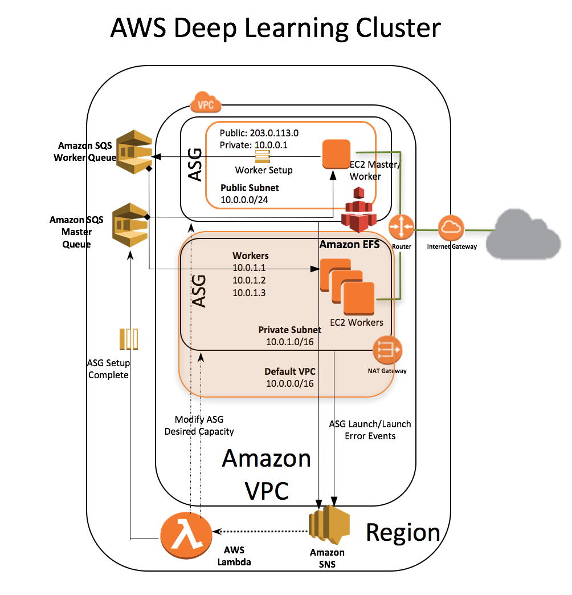

# **Distributed Deep Learning on AWS Using MXNet and TensorFlow**

[AWS CloudFormation](https://aws.amazon.com/cloudformation), which creates and configures Amazon Web Services resources with a template, simplifies the process of setting up a distributed deep learning cluster. The AWS CloudFormation Deep Learning template uses the [Amazon Deep Learning AMI](https://aws.amazon.com/marketplace/pp/B01M0AXXQB) (which provides MXNet, TensorFlow, Caffe, Theano, Torch, and CNTK frameworks) to launch a cluster of [EC2](https://aws.amazon.com/ec2) instances and other AWS resources needed to perform distributed deep learning.  
With this template, we continue with our mission to make [distributed deep learning easy](https://aws.amazon.com/blogs/compute/distributed-deep-learning-made-easy/). AWS CloudFormation creates all resources in the customer account. 

## What's New?  
We've updated the AWS CloudFormation Deep Learning template to add some exciting new features and capabilities.

* We now support 5 AWS regions - us-east-1, us-east-2, us-west-2, eu-west-1 and ap-southeast-2.

*  We've enhanced the AWS CloudFormation Deep Learning template with automation that continues stack creation even if the provisioned number of worker instances falls short of the desired count. In the previous version of the template, if one of the worker instances failed to be provisioned, for example, if it a hit account limit, AWS CloudFormation rolled back the stack and required you to adjust your desired count and restart the stack creation process. The new template includes a function that automatically adjusts the count down and proceeds with setting up the rest of the cluster (stack).  

*  We now support creating a cluster of CPU Amazon EC2 instance types. 

*  We've also added [Amazon Elastic File System (Amazon EFS)](https://aws.amazon.com/efs/) support for the cluster created with the template.  
	*  Amazon EFS is automatically mounted on all worker instances during startup.  
	*  Amazon EFS allows sharing of code, data, and results across worker instances.  
	*  Using Amazon EFS doesn't degrade performance for densely packed files (for example, .rec files containing image data).  

* We now support creating a cluster of instances running Ubuntu. See the [Ubuntu Deep Learning AMI](https://aws.amazon.com/marketplace/pp/B06VSPXKDX).

## EC2 Cluster Architecture 
The following architecture diagram shows the EC2 cluster infrastructure.  
  

## Resources Created by the Deep Learning Template
The Amazon Deep Learning template creates a stack that contains the following resources:  

* A VPC in the customer account. 
* The requested number or available number of worker instances in an [Auto Scaling](https://aws.amazon.com/autoscaling) group within the VPC. These worker instances are launched in a private subnet. 
* A master instance in a separate Auto Scaling group that acts as a proxy to enable connectivity to the cluster with SSH. AWS CloudFormation places this instance within the VPC and connects it to both the public and private subnets. This instance has both public IP addresses and DNS.
* An Amazon EFS file storage system configured in General Purpose performance mode.
* A mount target to mount Amazon EFS on the instances.
* A security group that allows external SSH access to the master instance.
* A security group that allows the master and worker instances to mount and access Amazon EFS through NFS port 2049.  
* Two security groups that open ports on the private subnet for communication between the master and workers. 
* An [AWS Identity and Access Management (IAM)](https://aws.amazon.com/iam) role that allows instances to poll [Amazon Simple Queue Service (Amazon SQS)](https://aws.amazon.com/sqs/) and access and query Auto Scaling groups and the private IP addresses of the EC2 instances.
* A NAT gateway used by the instances within the VPC to talk to the outside world. 
* Two Amazon SQS queues to configure the metadata at startup on the master and the workers.
* An [AWS Lambda](https://aws.amazon.com/lambda/) function that monitors the Auto Scaling group's launch activities and modifies the desired capacity of the Auto Scaling group based on availability.
* An [Amazon Simple Notification Service (Amazon SNS)](https://aws.amazon.com/sns/) topic to trigger the Lambda function on Auto Scaling events.
* AWS CloudFormation WaitCondition and WaitHandler, with a stack creation timeout of 55 minutes to complete metadata setup.

## How the Deep Learning Template Works
The startup script enables SSH forwarding on all hosts. Enabling SSH agent forwarding is essential because frameworks such as MXNet use SSH for communication between master and worker instances during distributed training.  

The startup script on the master polls the master SQS queue for messages confirming that Auto Scaling setup is complete. The Lambda function sends two messages, one when the master Auto Scaling group is successfully set up, and a second when either the requested capacity is satisfied or when instances fail to launch on the worker Auto Scaling group. When instance launch fails on the worker Auto Scaling group, the Lambda function modifies the desired capacity to the number of instances that have been successfully launched.

Upon receiving messages on the Amazon SQS master queue, the setup script on the master configures all of the necessary worker metadata (IP addresses of the workers, GPU count, etc.,) and broadcasts the metadata on the worker SQS queue. Upon receiving this message, the startup script on the worker instances that are polling the SQS worker queue configure this metadata on the workers. 

The following environment variables are set up on all the instances: 

* **$DEEPLEARNING_WORKERS_PATH**: The file path that contains the list of workers  

* **$DEEPLEARNING_WORKERS_COUNT**: The total number of workers  

* **$DEEPLEARNING_WORKER_GPU_COUNT**: The number of GPUs on the instance

* **$EFS_MOUNT**: The directory where Amazon EFS is mounted

## Setting Up a Deep Learning Stack 
To set up a deep learning AWS CloudFormation stack, follow [Using the AWS CloudFormation Deep Learning Template](cfn-template/StackSetup.md).

## Running Distributed Training
To demonstrate how to run distributed training using [MXNet](http://mxnet.io/) and [Tensorflow](https://www.tensorflow.org/) frameworks, we use the standard [CIFAR-10 model](https://www.cs.toronto.edu/~kriz/cifar.html).  CIFAR-10 is a sufficiently complex network that benefits from a distributed setup and that can be quickly trained on such a setup.  

### Log in to the Master Instance
Follow **[Step 3](cfn-template/StackSetup.md#logintomaster)** in [Using the AWS CloudFormation Deep Learning Template](cfn-template/StackSetup.md).

### Clone the [awslabs/deeplearning-cfn](https://github.com/awslabs/deeplearning-cfn) repo that contains the examples onto the EFS mount

**Note:** This could take a few minutes.  

    git clone https://github.com/awslabs/deeplearning-cfn $EFS_MOUNT/deeplearning-cfn && \
    cd $EFS_MOUNT/deeplearning-cfn && \
    #
    #fetches dmlc/mxnet and tensorflow/models repos as submodules
    git submodule update --init $EFS_MOUNT/deeplearning-cfn/examples/tensorflow/models && \
    git submodule update --init $EFS_MOUNT/deeplearning-cfn/examples/mxnet && \
    cd $EFS_MOUNT/deeplearning-cfn/examples/mxnet/ && \
    git submodule update --init $EFS_MOUNT/deeplearning-cfn/examples/mxnet/dmlc-core

### Running Distributed Training on MXNet 

The following example shows how to run CIFAR-10 with data parallelism on MXNet. Note the use of the DEEPLEARNING_* environment variables.

	#terminate all running Python processes across workers 
	while read -u 10 host; do ssh -o "StrictHostKeyChecking no" $host "pkill -f python" ; \
	done 10<$DEEPLEARNING_WORKERS_PATH

	#navigate to the MXNet image-classification example directory \
	cd $EFS_MOUNT/deeplearning-cfn/examples/mxnet/example/image-classification/
	
	#run the CIFAR10 distributed training example \
	../../tools/launch.py -n $DEEPLEARNING_WORKERS_COUNT -H $DEEPLEARNING_WORKERS_PATH \
	python train_cifar10.py --gpus $(seq -s , 0 1 $(($DEEPLEARNING_WORKER_GPU_COUNT - 1))) \
	--network resnet --num-layers 50 --kv-store dist_device_sync

We were able to run the training for 100 epochs in 25 minutes on 2 P2.8x EC2 instances and achieve a training accuracy of 92%.  

These steps summarize how to get started. For more information about running distributed training on MXNet, see [Run MXNet on Multiple Devices](http://mxnet.readthedocs.io/en/latest/how_to/multi_devices.html). 

### Running Distributed Training on TensorFlow 
The new template introduces [Amazon Elastic File System](https://aws.amazon.com/efs/), which facilitates sharing data among workers, store the checkpoints and the logs of all the tensorlfow processes in one place. You can now monitor all the logs on the master instance.

For the TensorFlow distributed training example, we use the CIFAR-10 model provided by [TensorFlow](https://www.tensorflow.org/tutorials/deep_cnn#cifar-10_model) and the distributed training sample code discussed in [Distributed Tensorflow](https://www.tensorflow.org/versions/master/how_tos/distributed/). 

**Note** This distributed training example is not tuned to achieve the greatest accuracy. It merely
shows how the deep learning AWS CloudFormation stack simplifies running a distributed TensorFlow training.

Download the CIFAR-10 dataset from [Alex Krizhevsky's page](http://www.cs.toronto.edu/~kriz/cifar-10-binary.tar.gz)
and unzip the tar.gz file onto the EFS mount so you don't have to copy or download the dataset on all of the workers.

    mkdir $EFS_MOUNT/cifar10_data && \
    wget http://www.cs.toronto.edu/~kriz/cifar-10-binary.tar.gz --directory-prefix=$EFS_MOUNT/cifar10_data \
    && tar -xzvf $EFS_MOUNT/cifar10_data/cifar-10-binary.tar.gz -C $EFS_MOUNT/cifar10_data

We have included a script in the [awslabs/deeplearning-cfn](https://github.com/awslabs/deeplearning-cfn/blob/master/examples/tensorflow/generate_trainer.py) repo that generates the commands to run the tensorflow workers and parameter servers on the instances. The script takes training_script as an argument, you can also pass the arguments that are needed by your distributed training script as additional arguments.

    cd $EFS_MOUNT/deeplearning-cfn/examples/tensorflow && \
    # generates commands to run workers and parameter-servers on all the workers \
    python generate_trainer.py --workers_file_path $DEEPLEARNING_WORKERS_PATH \
    --worker_count $DEEPLEARNING_WORKERS_COUNT \
    --worker_gpu_count $DEEPLEARNING_WORKER_GPU_COUNT \
    --trainer_script_dir $EFS_MOUNT/deeplearning-cfn/examples/tensorflow \
    --training_script $EFS_MOUNT/deeplearning-cfn/examples/tensorflow/cifar10_multi_machine_train.py \
    --batch_size 128 --data_dir=$EFS_MOUNT/cifar10_data \
    --train_dir=$EFS_MOUNT/deeplearning-cfn/examples/tensorflow/train \
    --log_dir $EFS_MOUNT/deeplearning-cfn/examples/tensorflow/logs \
    --max_steps 200000

Stop all of the Python processes that might be running on the workers:

    #terminate all running Python processes across workers \
    while read -u 10 host; do ssh -o "StrictHostKeyChecking no" $host "pkill -f python" ; \
    done 10<$DEEPLEARNING_WORKERS_PATH

Run the distributed training across all of the workers:

    trainer_script_dir=$EFS_MOUNT/deeplearning-cfn/examples/tensorflow && while read -u 10 host; \
    do ssh -o "StrictHostKeyChecking no" $host "bash $trainer_script_dir/$host.sh" ; \
    done 10<$DEEPLEARNING_WORKERS_PATH

Because the logs of all of the workers and the process status processes are stored on Amazon EFS, you can now monitor them on the master:

    tail -f $EFS_MOUNT/deeplearning-cfn/examples/tensorflow/logs/*

We were able train this model in an hour on 2 P2.8x EC2 instances running 2 process status processes and 16 worker processes for 200000 steps and reduce the loss to 0.82 averaged across the 16 workers.

Running the evaluation script on the trained model achieves an accuracy of 77%:

    python $EFS_MOUNT/deeplearning-cfn/examples/tensorflow/models/tutorials/image/cifar10/cifar10_eval.py \
    --data_dir=$EFS_MOUNT/cifar10_data/ \
    --eval_dir=$EFS_MOUNT/deeplearning-cfn/examples/tensorflow/eval \
    --checkpoint_dir=$EFS_MOUNT/deeplearning-cfn/examples/tensorflow/train

You can visualize the training on [TensorBoard](https://www.tensorflow.org/get_started/summaries_and_tensorboard) by running the following command on the master node. TensorBoard starts running on the private IP address of the master instance and port 6006. Make a note of this IP address because you will use it in the next command.

    tensorboard --logdir $EFS_MOUNT/deeplearning-cfn/examples/tensorflow/train

Now use SSH port forwarding to see TensorBoard on your local computer. Run a command similar to the following on the local computer. (This uses SSH agent forwarding for credentials.)

    #In this example, 192.0.2.0 is the private IP of the master and 203.0.113.0 is the public ip of the master instance, ec2-user is the userid of the master if Instance Type is Amazon Linux
    ssh -l ec2-user -L 6006:192.0.2.0:6006 203.0.113.0

To see TensorBoard, open [http://localhost:6006](http://localhost:6006) on a browser. For more information, see [TensorBoard: Visualizing Learning](https://www.tensorflow.org/get_started/summaries_and_tensorboard).
