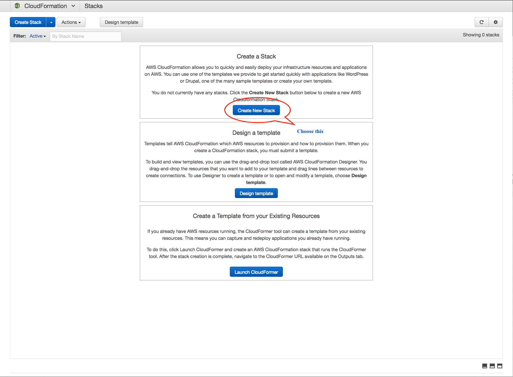
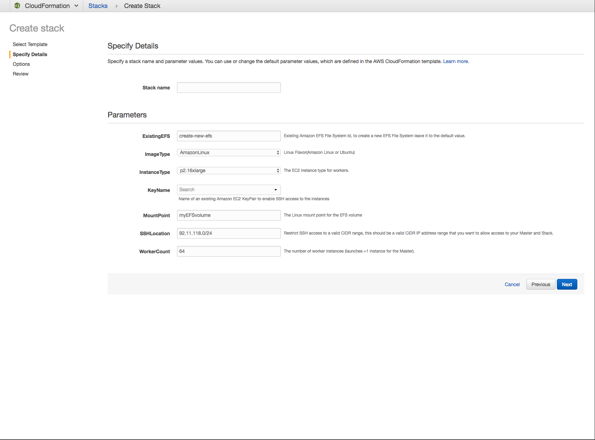
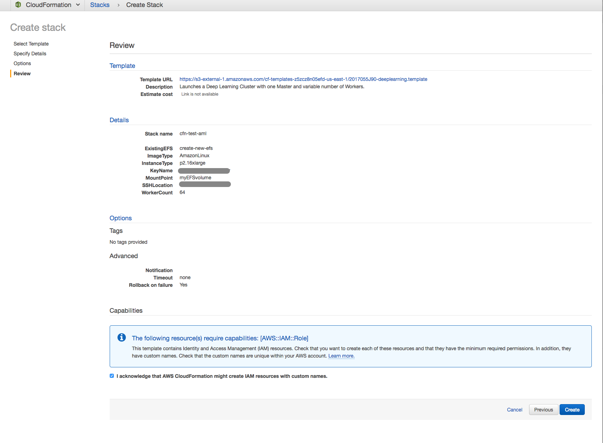
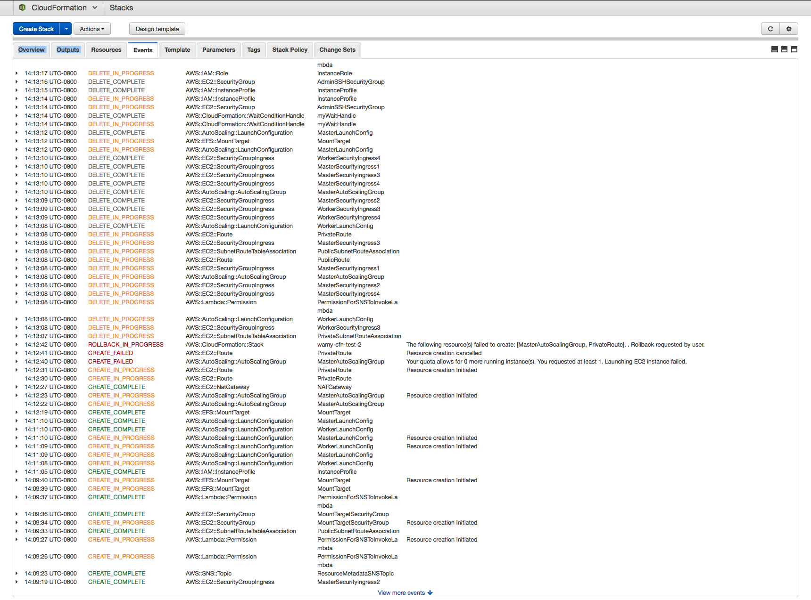
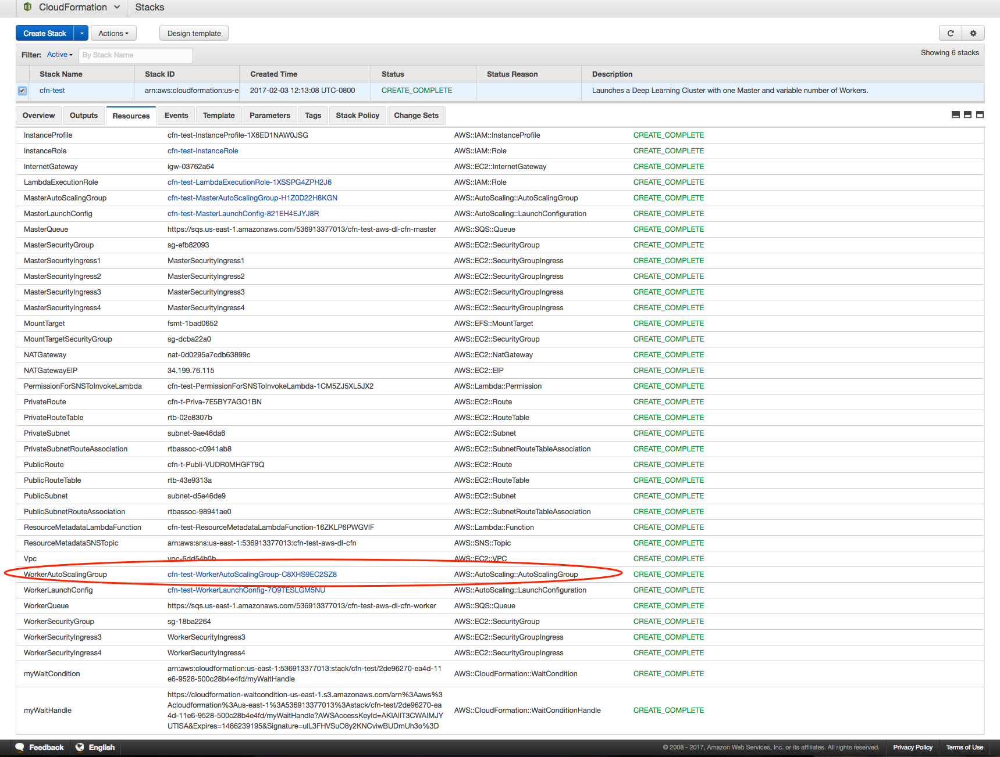
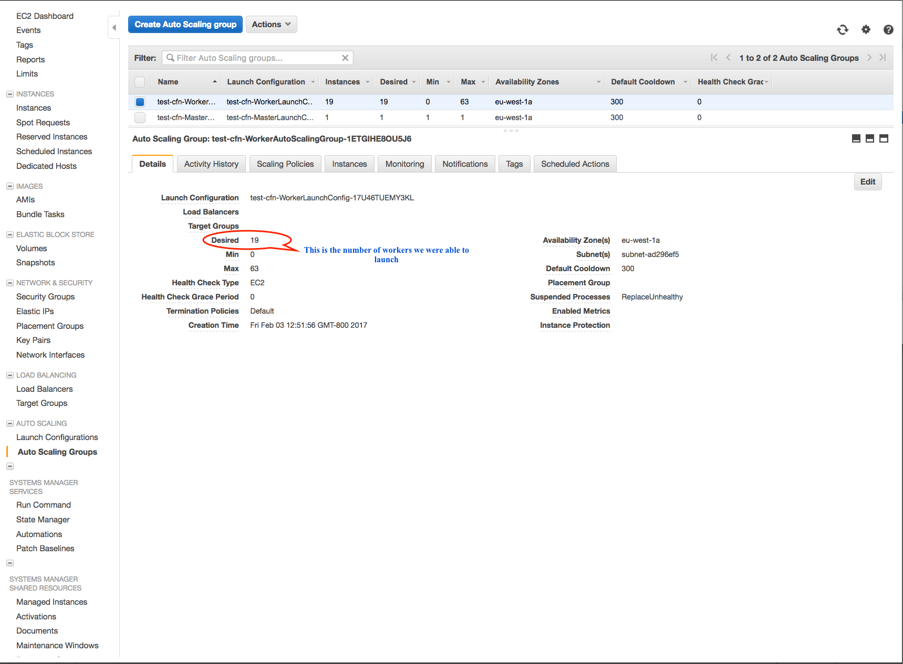
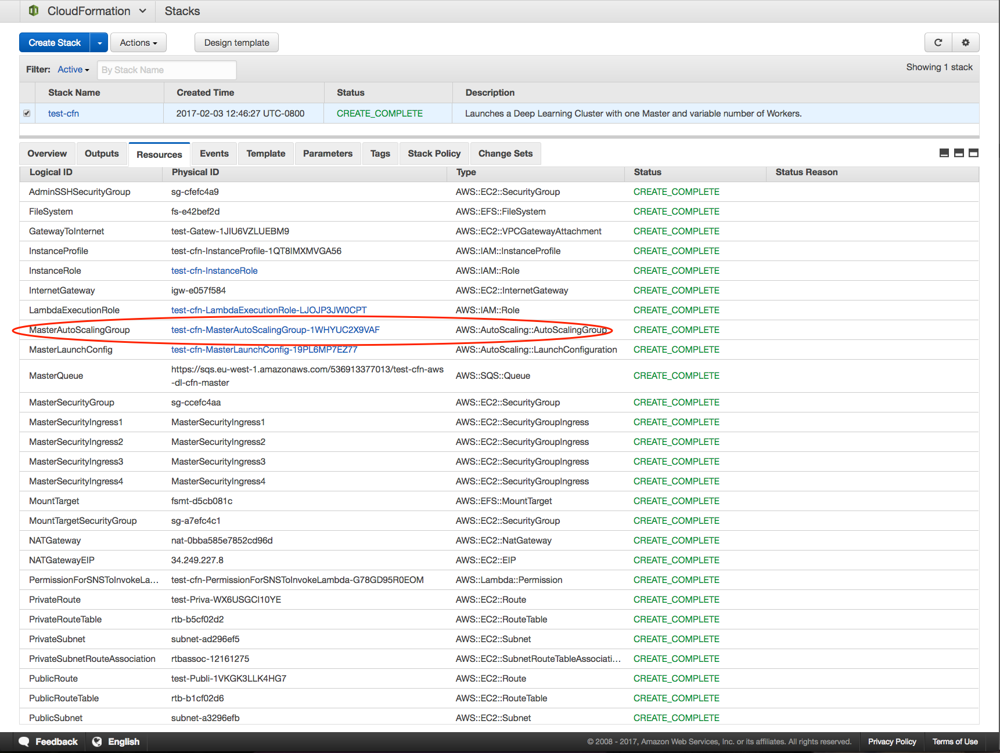
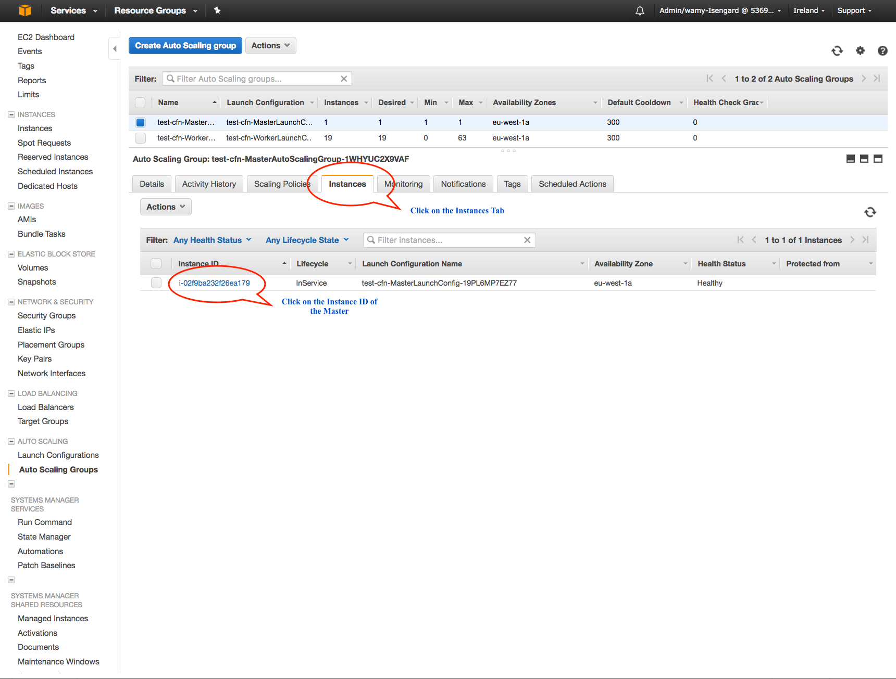
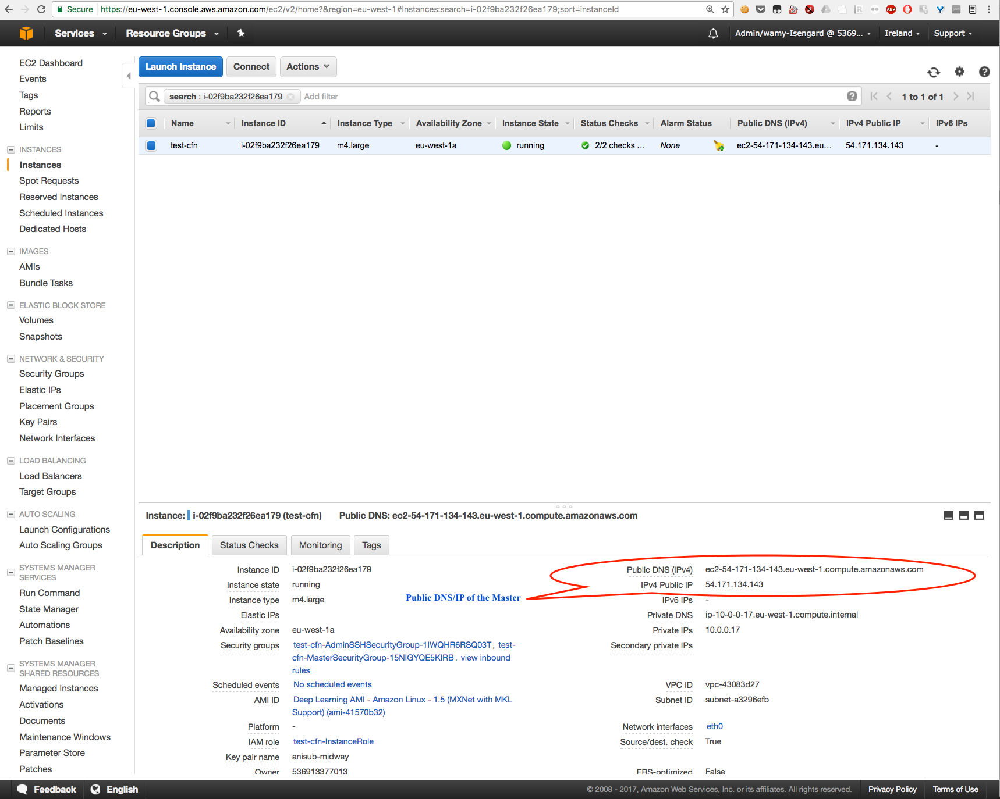

# Using the AWS CloudFormation Deep Learning Template

Setting up and using the template requires three steps:

1. Launching an AWS CloudFormation stack
2. Finding the number of worker instances that successfully launched
3. Logging in to the master instance  

## Step 1: Launch an AWS CloudFormation Stack

**Note**  

If you need to scale the number of instances beyond the [default limit](https://aws.amazon.com/ec2/faqs/#How_many_instances_can_I_run_in_Amazon_EC2), file a [support request](https://aws.amazon.com/contact-us/ec2-request).

**To launch the stack**:

1. Download the Deep Learning template from the [awslabs/deeplearning-cfn GitHub repo](https://raw.githubusercontent.com/awslabs/deeplearning-cfn/master/cfn-template/deeplearning.template)

2. Open the [AWS CloudFormation console](https://console.aws.amazon.com/cloudformation), and then choose **Create New Stack**.
  

3. To upload the template, choose **Choose File**, and then choose **Next**.
  

4. For **Stack name**, type a descriptive name.

5. For **EFSFileSystemId**, you can either enter an existing Amazon EFS File System Id or leave it blank to create a new Amazon EFS file system.

6. For **EFSMountPoint**, type the path where you want to mount the Amazon EFS file system on the instances.  

7. Choose an **ImageType**, Amazon Linux or Ubuntu.

8. Choose an **InstanceType**, such as [p3.2xlarge](https://aws.amazon.com/ec2/instance-types/p3/).

9. For **KeyName**, choose an EC2 key pair.  

10. For **SSHLocation**, choose a valid CIDR IP address range to allow SSH access to the master instance and stack.  

11. For **Worker Count**, type a value. The stack provisions the worker count that you specify plus one more, with the additional instance acting as the master. The master also participates in training, evaluation, or both. Choose **Next**.
  

12. (Optional) In the **Tags** section, type values for **Key** and **Value**. This allows you to assign metadata to your resources.  
13.  (Optional) In the **Permissions** section, choose the AWS Identity and Access Management (IAM) role that AWS CloudFormation uses to create the stack. Choose **Next**.

14. In the **Capabilities** section, select the check box to agree to allow AWS CloudFormation to create an IAM role. The IAM role is required for setting up a stack.  

15. Review your settings, and choose **Create.**
  

16. To see the status of your stack, choose **Events**. If stack creation fails, because of an access issue or an unsupported number of workers, for example, troubleshoot the issue.  
For information about troubleshooting stack creation, see [Troubleshooting AWS CloudFormation](http://docs.aws.amazon.com/AWSCloudFormation/latest/UserGuide/troubleshooting.html). Check the event log to see the reason for the failure. 
  
  
## Step 2: Find the number of worker instances that successfully launched

As noted earlier, we might not always be able provision the requested number of worker instances and the stack would dynamically adjust the cluster to the maximum number of available worker instances when an instance fails to provision (perhaps due to reached limit). If the stack is unable to launch even a single instance within the timeout period, AWS CloudFormation  rolls the stack back.

**To find the number of workers that the template was able to launch:**

1. In the AWS CloudFormation console, choose the stack, and then choose the **Resources** tab to see the details for the worker Auto Scaling group. Choose the Auto Scaling group ID for **WorkerAutoScalingGroup**.  
  

2. On the Amazon EC2 console, in the **Auto Scaling Groups section**, you can see the **Desired** capacity of the WorkerAutoScaling group. This is the number of worker instances that you can launch.
  

## Step 3: Log in to the master instance

SSH agent forwarding securely connects the instances within the VPC, which are connected to the private subnet. To set up and use SSH agent forwarding, see [Securely Connect to Linux Instances Running in a Private Amazon VPC](https://aws.amazon.com/blogs/security/securely-connect-to-linux-instances-running-in-a-private-amazon-vpc/).  

**To log in to the master instance:**

1. Find the public DNS/IP address of the master.  In the AWS CloudFormation console, navigate to the AWS CloudFormation  stack.  To see the Auto Scaling group in which the master instance is launched, choose the **Resources** tab. Choose the Auto Scaling group **Physical ID** for the **MasterAutoScalingGroup**.  
  

    a. On the **Auto Scaling** page on the [Amazon EC2 console](https://console.aws.amazon.com/ec2), find the Instance ID of the master instance by choosing the **Instances** tab, and then choosing the Instance ID.
  

    b. When you choose the **Instance ID**, EC2 displays details about the master instance, including the public DNS/IP address that you need to log in. Make a note of the address because you will need it in the next step.  
  

2. Enable SSH agent forwarding. This enables communication with all of the instances in the private subnet. Using the DNS/IP address that you recorded in the first step, modify the SSH configuration(~/.ssh/config file) to include these lines:

    	Host IP/DNS-from-above  
        ForwardAgent yes

3. Log in to the master instance. If you have not already done so, follow the steps in [Securely Connect to Linux Instances Running in a Private Amazon VPC](https://aws.amazon.com/blogs/security/securely-connect-to-linux-instances-running-in-a-private-amazon-vpc/) to enable forwarding your credentials when you use SSH to connect to the master instance. If you neglect this step, distributed training that requires SSH communication will fail.  

    On macOS, type:

         ssh -A <USER-ID>@<MASTER-WORKER-PUBLIC-DNS/IP>
         #USER-ID is ec2-user for Amazon Linux, ubuntu for Ubuntu

    On the Windows platform, type:

         ssh <USER-ID>@<MASTER-WORKER-PUBLIC-DNS/IP>
         #USER-ID is ec2-user for Amazon Linux, ubuntu for Ubuntu

For examples of running distributed training, see [Deep Learning on AWS Using MXNet and TensorFlow](../README.md).

# FAQ

### Q. How do I change the IP addresses that are allowed to connect to the master instance with SSH?
The AWS CloudFormation stack output contains the security group that controls the inbound IP addresses for SSH access to the master instance. Use this security group to change your inbound IP addresses.  

### Q. When an instance is replaced, are the IP addresses of the instances updated? 
No. You must update IP addresses manually.  

### Q. Does the master instance participate in training and validation?
Yes, the master instance acts both as a proxy and as a distributed training and validation instance.

### Q. Why are the instances in an Auto Scaling group? 
An [Auto Scaling](https://aws.amazon.com/autoscaling/) group maintains the number of desired instances by launching a new instance if an instance fails. There are two Auto Scaling groups: one for the master and one for the workers in the private subnet. Because only the master instance has a public endpoint to access the hosts in the stack, if the master instance becomes unavailable, you can terminate it. The associated Auto Scaling group automatically launches a new master instance with a new public endpoint. 

### Q. When a new worker instance is added or an existing instance is replaced, does AWS CloudFormation update the IP addresses on the master instance?
No, this template does not have the capability to automatically update the IP address of the replacement instance.

### Q. Why does stack creation fail when I use an existing Amazon EFS file system that is attached to a mount target?
You can use an Amazon EFS file system in only one VPC at a time. If your Amazon EFS system is attached to a different VPC, delete the association by following the instructions in [Creating or Deleting Mount Targets in a VPC](http://docs.aws.amazon.com/efs/latest/ug/manage-fs-access-create-delete-mount-targets.html).
